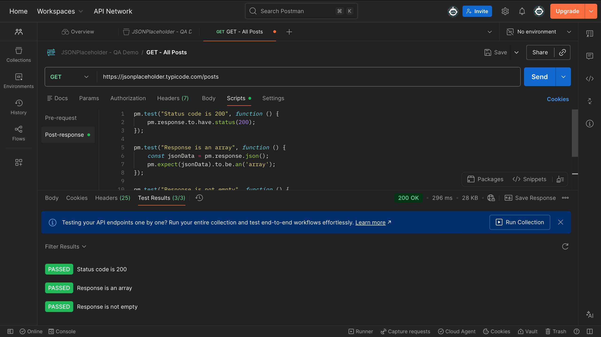
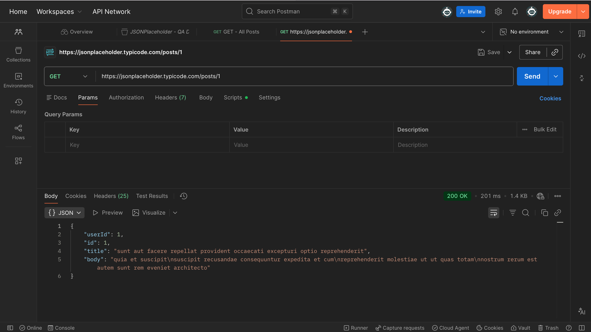
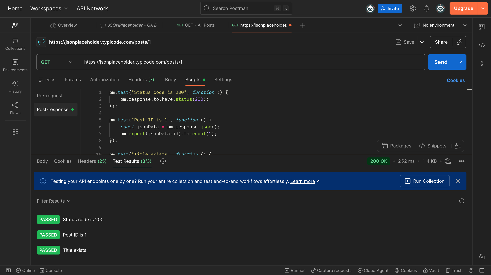
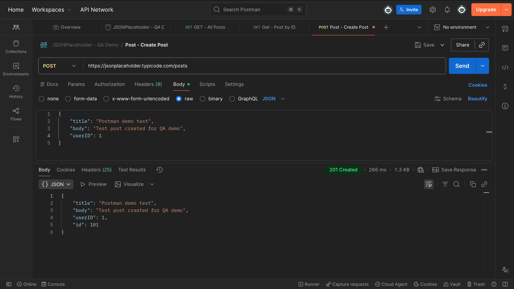
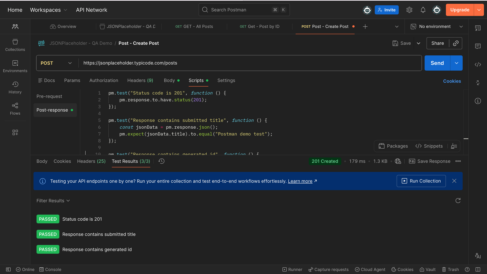
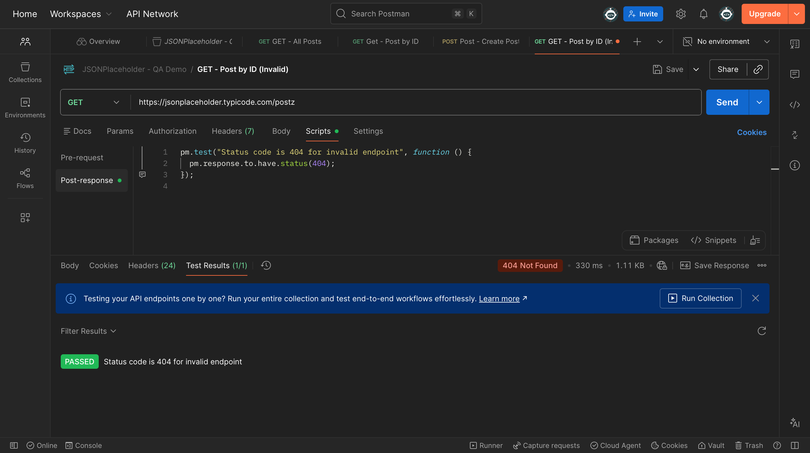

# postman-demo-project
A simple Postman project demonstrating API testing using GET and POST requests, basic assertions, and negative test scenarios against a public REST API.

---

## Project Goals

- Practice sending GET and POST requests using Postman
- Validate API responses using basic assertions
- Explore how APIs behave in both successful and error scenarios
- Build a small, focused API testing example suitable for an entry-level QA portfolio

---

## What This Project Includes

- A Postman collection testing the JSONPlaceholder REST API
- Get requests to retrieve all posts and a specific post by ID
- A POST request to create a new post
- Basic assertions validating status codes and response bodies
- A negative test case for an invalid endpoint (404 response)
- Screenshots showing request execution and test results

---

## Screenshots

**GET - All Posts**

**GET - Post by ID**

**POST - Create Post**

**Negative Test - Invalid Endpoint**

---

## Why This Matters

API testing is a core part of modern QA roles. This project demonstartes an understanding of how to validate API behaviour independently of any user interface, focusing on response correctness, error handling, and clear documentation.

---

## Next Steps

- Explore basic test automation concepts for API or UI testing
- Expand assertions as part of further Postman practice

---

## 📬 Let’s Connect

If you're a hiring manager, mentor, or fellow learner, I’d love to hear your thoughts. Feel free to explore my [other projects](https://github.com/Tmoorin7) or reach out.

